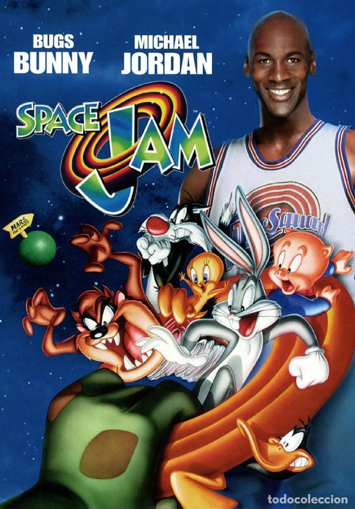

# PEC3 – Manovich Reloaded  
**Autor/a:** David González Bustamante  
**Asignatura:** Cultura digital  

---

## Introducción general

A partir del análisis de diversos casos de hibridación en el libro *El software toma el mando*, este trabajo propone dos nuevos ejemplos que podrían integrarse perfectamente en una hipotética segunda edición de la obra. El propósito es ampliar la mirada propuesta por Manovich hacia otros fenómenos culturales y tecnológicos que evidencian la evolución del ordenador como metamedio, así como su capacidad para transformar los lenguajes y las estructuras narrativas tradicionales.

El análisis se ha desarrollado aplicando conceptos clave como mutación, hibridación técnica, estética digital, interfaz y lógica de software. Además, la elaboración del documento se alinea con una filosofía de conocimiento compartido, inspirada en el desarrollo colaborativo del software libre y en entornos abiertos como GitHub, donde el uso del lenguaje Markdown permite estructurar ensayos accesibles y reutilizables.

Este enfoque no solo refleja el contenido del análisis, sino también su forma: escribir en red, compartir ideas y licenciar bajo Creative Commons es parte del proceso de construcción cultural del siglo XXI. Los casos aquí expuestos representan, tanto una aportación teórica como una práctica de producción digital abierta.

---

## Caso 1: *Dragon Ball Z: Kakarot* (Bandai Namco, 2020)

### Descripción del caso

*Dragon Ball Z: Kakarot* es un videojuego de rol y acción lanzado en 2020 por Bandai Namco para PlayStation 4, Xbox One y PC. Basado en el universo del mítico anime *Dragon Ball Z*, el juego ofrece una experiencia interactiva que mezcla combates en tiempo real, exploración tipo mundo abierto y escenas narrativas que replican fielmente el estilo y contenido de la serie original. Sin olvidar los DLCs que han ido sacando como forma de ampliar el juego con nuevas historias que enlazan otras distribuciones como Dragon Ball Super. 

A través del uso de gráficos cel-shading, que imitan el trazo y la textura del dibujo animado en entornos 3D, *Kakarot* no solo adapta la historia original, sino que propone una nueva forma de vivirla, combinando medios, lenguajes y lógicas narrativas diversas. Este videojuego no es solo una adaptación de un anime: es un ejemplo claro de hibridación donde se fusionan el lenguaje audiovisual, la interactividad lúdica y las estructuras de datos propias del medio software.

---

### Análisis de hibridación mediática (con “las gafas de Manovich”)

Siguiendo la teoría de Lev Manovich (2013), el ordenador como metamedio permite la fusión de técnicas de medios anteriores en nuevas formas digitales. *Kakarot* es un ejemplo de esa hibridación avanzada, donde múltiples medios se reconfiguran como software.

- **Mutación técnica y estética:** A través de cel-shading y animaciones dinámicas, Kakarot imita el estilo del anime 2D tradicional en un entorno 3D navegable. Esta técnica no solo traduce visualmente un medio a otro, sino que funde sus principios estéticos y técnicos, generando una nueva experiencia visual que es a la vez interactiva y fiel a su origen animado.

- **Narrativa híbrida:** El juego integra cinemáticas no interactivas que reproducen escenas icónicas del anime con segmentos jugables que permiten al usuario encarnar a Goku y otros personajes. Esta alternancia crea una forma de narración híbrida, donde se combina la linealidad del relato clásico con la interactividad estructural del videojuego. La lógica del medio televisivo se ve transformada por la lógica del software.

- **Interfaz compuesta:** El HUD del juego (barras de energía, menús de misiones, sistema de combos) se integra visual y funcionalmente en la estética del anime. La interfaz no es ajena al mundo narrativo, sino que forma parte del lenguaje visual de la obra, difuminando la frontera entre representación y control del usuario.

- **Manipulación de datos como motor de experiencia:** El juego gestiona y transforma grandes volúmenes de datos —estadísticas de combate, progresión de habilidades, eventos narrativos— que configuran una experiencia personalizada para cada jugador. Aquí se evidencia el paso al tercer nivel de Manovich: la lógica del software como medio que articula y reconfigura otros medios.

---

### Conclusión

*Dragon Ball Z: Kakarot* no es simplemente un juego basado en un anime: es una experiencia híbrida en la que conviven el lenguaje del manga japonés, la estructura narrativa del cine y la lógica procedural del videojuego. Es un ejemplo maduro de hibridación mediática en la era del software, donde la distinción entre medios tradicionales (televisión, cómic, cine) pierde sentido ante un nuevo entorno digital integrado.

Este juego representa claramente cómo el ordenador ha dejado de ser solo un medio de reproducción para convertirse en el metamedio por excelencia, capaz de simular y transformar cualquier forma anterior. Como diría Manovich, no estamos ante una simple remediación, sino ante una nueva gestalt mediática, un medio autónomo nacido de la fusión y reorganización de otros.

---

## Caso 2: *Space Jam* (Joe Pytka, 1996)

### Descripción del caso

La película *Space Jam*, estrenada en 1996 y protagonizada por Michael Jordan junto a los personajes animados de Looney Tunes, se convirtió en un fenómeno cultural. Dirigida por Joe Pytka y producida por Warner Bros., la cinta no solo combinaba animación 2D con imagen real, sino que representaba un punto de inflexión en la hibridación mediática. La interacción fluida entre actores reales y personajes animados no era solo un recurso estético, sino una estrategia técnica, narrativa y simbólica que marcaba una nueva forma de entender el cine comercial. 

Además, *Space Jam* formó parte de una estrategia transmedia pionera que incluía videojuegos, campañas publicitarias, juguetes y, muy especialmente, una de las primeras webs promocionales en la historia del cine, aún disponible en línea como reliquia de la era primitiva de internet.

---

### Análisis de hibridación mediática (con “las gafas de Manovich”)

Según Lev Manovich (2013), la hibridación ocurre cuando las técnicas, interfaces y lógicas propias de distintos medios se fusionan para generar nuevas formas de representación. Aunque Space Jam precede al auge del ordenador como metamedio plenamente desarrollado, ya anticipa muchos de los rasgos que Manovich identifica como señales de hibridación mediática:

- **Mutación técnica:** *Space Jam* fusiona dos técnicas audiovisuales previamente incompatibles: la acción en vivo (live action) y la animación tradicional 2D. Esta unión se logró mediante la integración de tecnologías de composición digital, que en 1996 aún eran innovadoras. Se digitalizaban las secuencias reales y se ajustaban con precisión para integrarlas con los fotogramas animados, lo que exigía un proceso minucioso cuadro por cuadro. Aquí ya vemos una mutación de medios, donde las técnicas del cine animado se reescriben a través de herramientas digitales de edición y composición.

- **Estética híbrida:** Visualmente, la película genera una nueva estética en la que los límites entre lo real y lo dibujado se desdibujan. No se trata de yuxtaponer imagen real con animación como en *¿Quién engañó a Roger Rabbit?*, sino de hacer que ambos compartan el mismo espacio visual y narrativo, interactuando en tiempo y espacio como si fueran parte de un mismo universo físico y simbólico.

- **Lógica narrativa compuesta:** La historia incorpora elementos típicos del cine deportivo, la fantasía animada y la cultura pop, integrando géneros distintos que conviven en una nueva forma narrativa. Esta lógica híbrida responde a las estrategias del metamedio: toma prestadas estructuras reconocibles de medios anteriores y las reconfigura mediante software y efectos digitales.

- **Precursores de interfaz transmedia:** Aunque la película no es interactiva, se conecta con una campaña transmedia innovadora para su época: la web oficial de Space Jam se considera una de las primeras experiencias web interactivas ligadas a un producto audiovisual. Ofrecía juegos, material extra y navegación gráfica. Esta interfaz web funcionaba como una extensión del universo fílmico, lo que anticipa la lógica de plataformas actuales como Disney+ o Netflix, donde las películas no son solo productos cerrados, sino nodos en un ecosistema digital.

---

### Conclusión

Space Jam fue una de las primeras películas comerciales que propuso un mundo visual híbrido entre lo animado y lo real, no como truco visual puntual, sino como universo coherente. Aunque hoy sus efectos puedan parecer rudimentarios, en 1996 representaba una nueva forma de representación mediática, basada en tecnologías digitales emergentes. En este sentido, el filme anticipa —sin saberlo— lo que Manovich más tarde definiría como una evolución del metamedio ordenador: cuando las técnicas de diferentes medios son convertidas en elementos de software combinables.

Su legado no está solo en su estética pop, sino en cómo sembró la semilla de un lenguaje visual nuevo, capaz de mezclar sin costuras lo virtual y lo físico. En una hipotética segunda edición de *El software toma el mando*, Space Jam tendría su lugar como caso pionero de hibridación digital en la era pre-Google.

---

## Bibliografía

- Manovich, L. (2013). *El software toma el mando*. 
- Manovich, L. (2007). *Understanding Hybrid Media*. http://manovich.net/content/04-projects/055-understanding-hybrid-media/52_article_2007.pdf  
- Bandai Namco. (2020). *Dragon Ball Z: Kakarot* [PS4].  
- Warner Bros. (1996). *Space Jam* [Película].  
- Sitio oficial de *Kakarot*: https://es.bandainamcoent.eu/dragon-ball/dragon-ball-z-kakarot/
- Sitio web de *Space Jam* (1996): https://www.spacejam.com/1996/  
- Xataka (2021). *El sitio web de Space Jam sigue en línea desde 1996*. https://www.xataka.com/

---

